# Consumer Shopping Preference Analysis

### What drives Online vs Store vs Hybrid shopping behavior?

A Python-based data product that explores **why consumers choose different shopping channels**, using demographic, behavioral, digital, and psychological data.

---

## Project Overview

This project investigates:

> **What drives consumer shopping preference (Store, Online, Hybrid)?**

Rather than focusing only on descriptive statistics, this project builds a **complete analytical workflow**:

* Data preprocessing
* Driver analysis
* Behavioral validation
* Lightweight ML validation

The goal is to deliver a **clear, interpretable, and product-oriented data analysis**, not just code.

---

## Data

The dataset used in this project is sourced from Kaggle:

https://www.kaggle.com/datasets/minahilfatima12328/consumer-shopping-trends-analysis

**Dataset:** Consumer Shopping Trends Analysis
**Source Platform:** Kaggle
**Accessed on:** April 2026

### Description

The dataset contains information on consumer shopping behaviour, including:

* demographic characteristics (age, income, gender, city tier)
* digital capability (internet usage, tech-savviness, payment trust)
* psychological factors (need for touch/feel, brand loyalty, price sensitivity)
* behavioural patterns (online vs store activity)
* target variable: **shopping_preference (Store / Online / Hybrid)**

### Usage Note

This dataset is publicly available for educational and analytical purposes.
All analysis in this project is conducted for academic use only.

---

## Key Insights

* **Store remains the dominant shopping preference**
* **Demographic factors have limited explanatory power**
* **Digital capability plays a moderate role**
* **Psychological factors are the strongest drivers**
* The **need to physically see/touch products** is the most important factor

Overall conclusion:

> Shopping preference is driven more by **experience perception** than by demographic identity.

---

## Visual Highlights

Below are key visual summaries that capture the main findings of the analysis.

---

### 1. Overall Shopping Preference Landscape

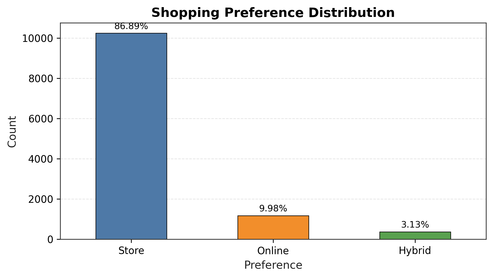

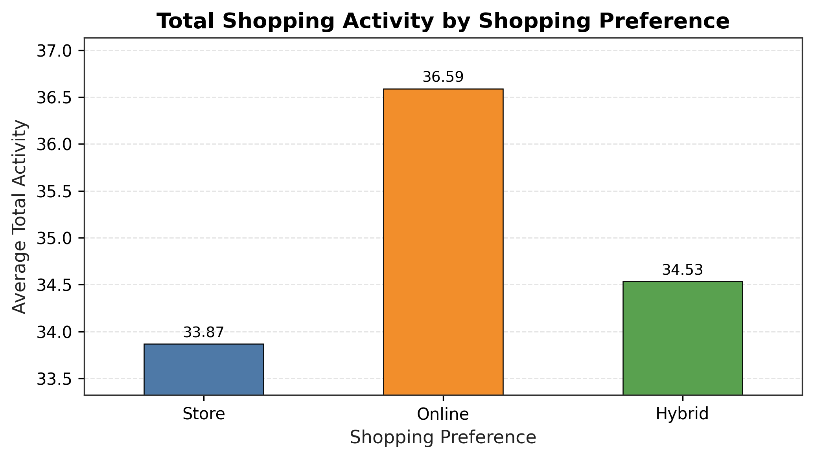

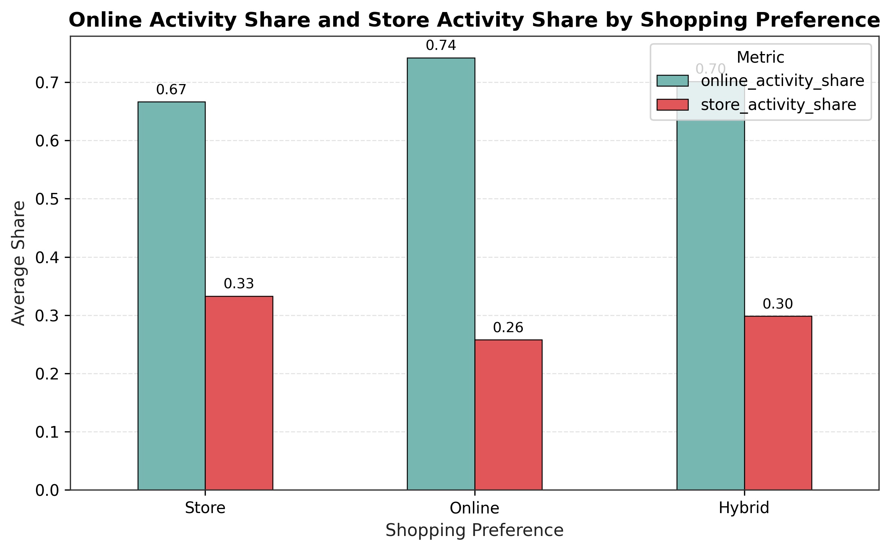

---

### 2. Psychological Drivers (Strongest Factors)

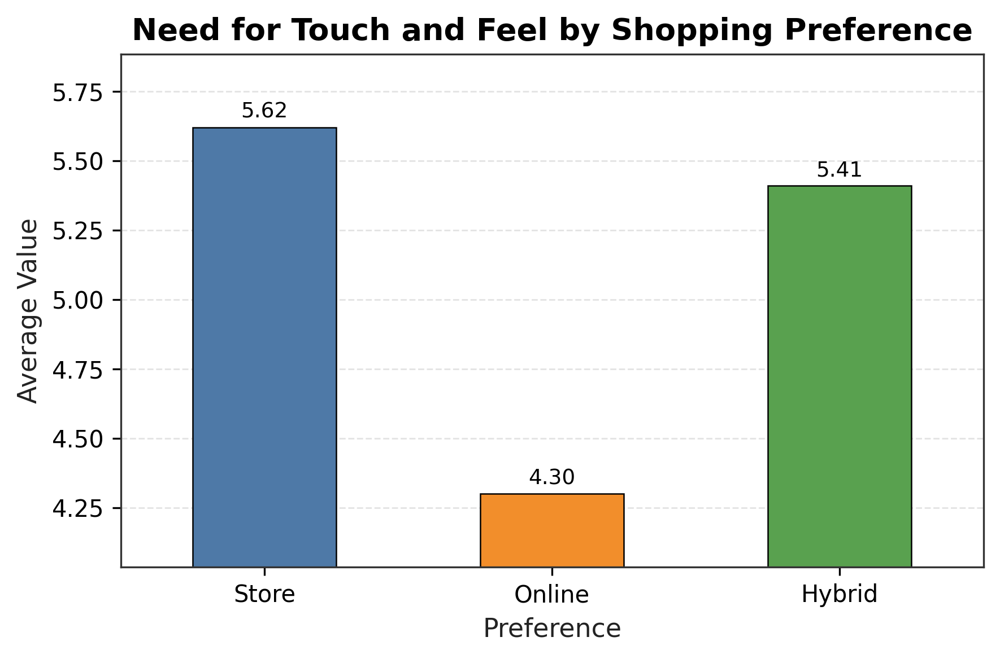

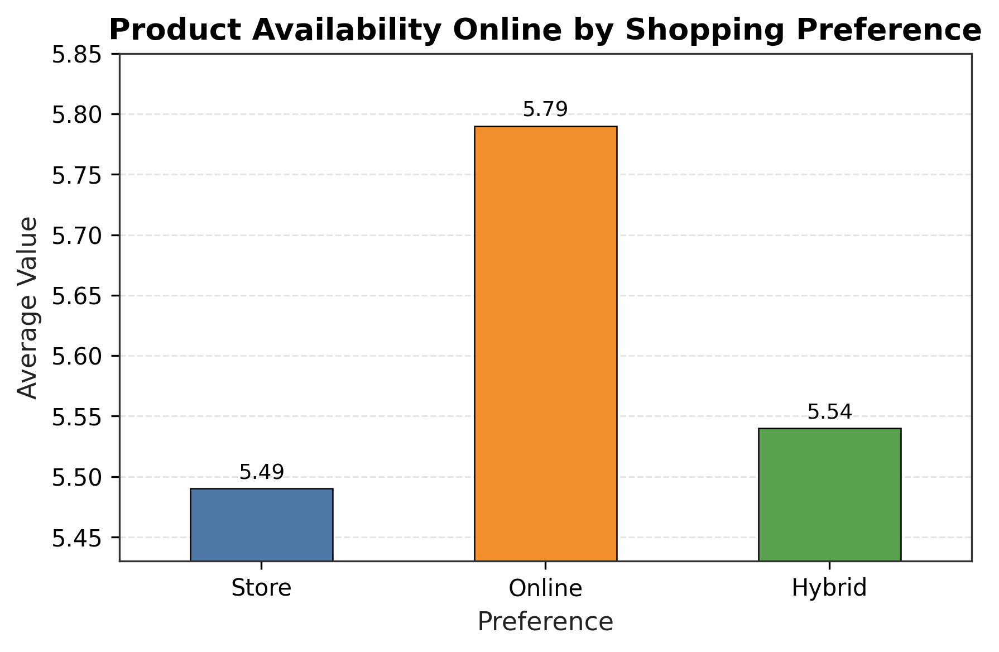

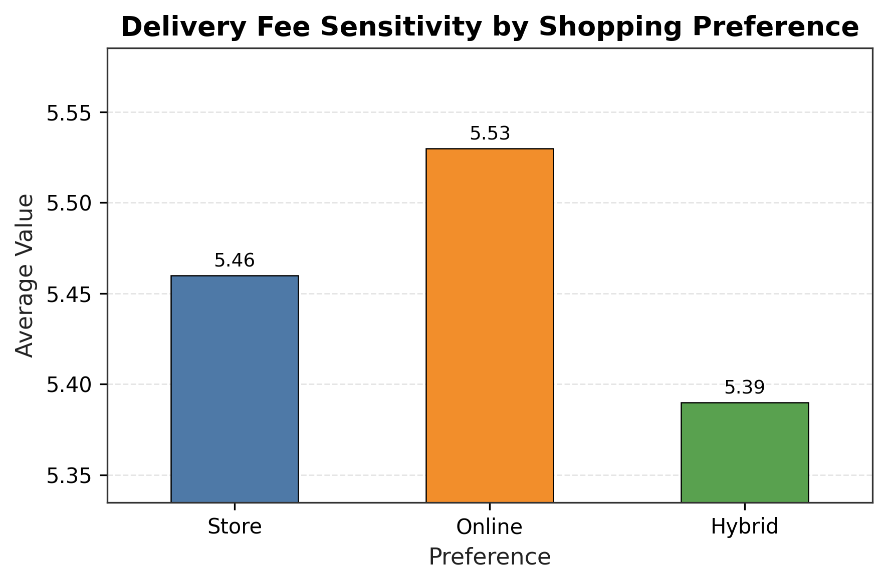

---

### 3. Digital Capability (Moderate Influence)

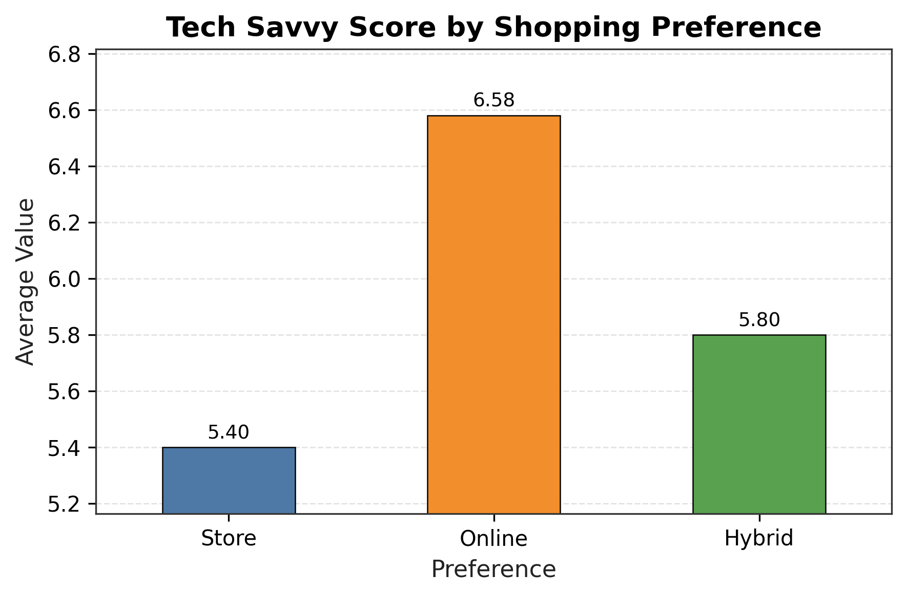

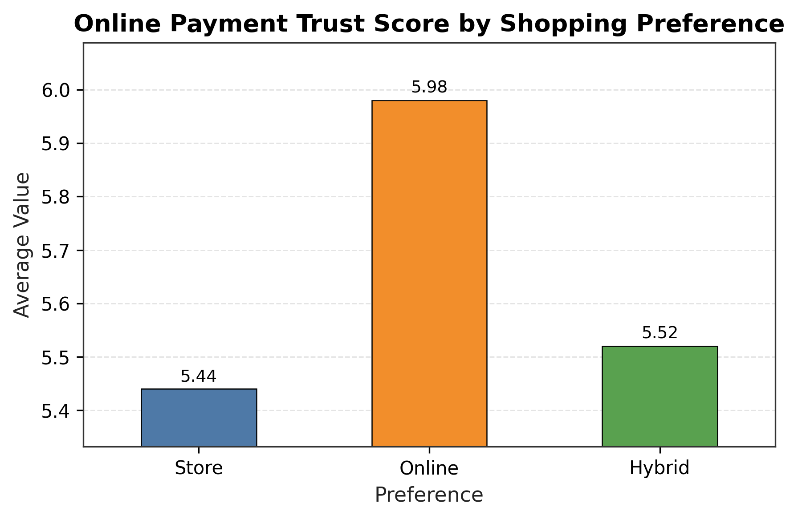

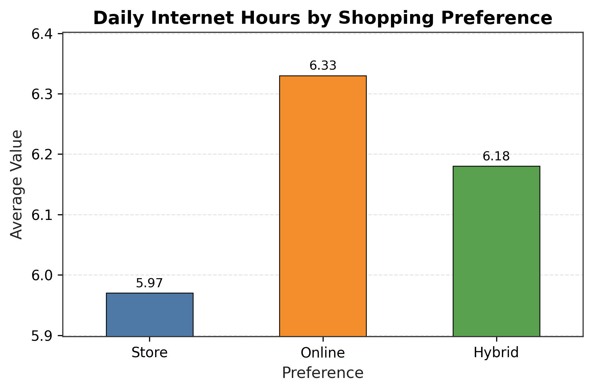

---

### 4. Demographic Factors (Weak Influence)

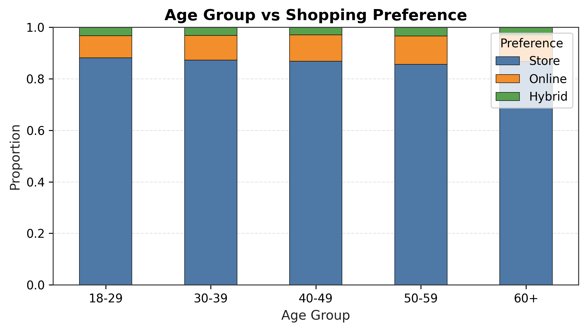

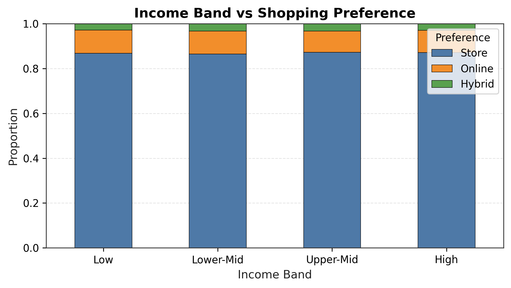

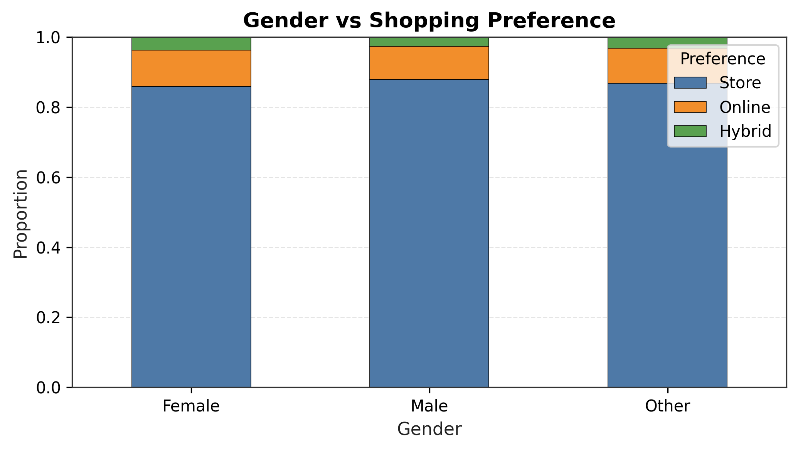

---

### 5. ML Validation (Supporting Evidence)

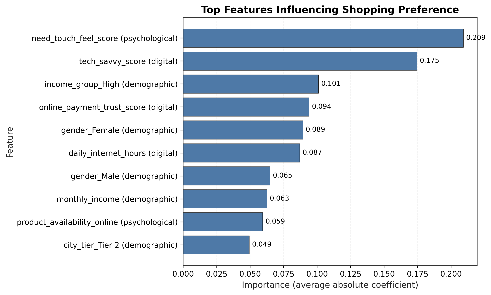

---

## Methodology

The project follows a structured analytical pipeline:

### 1. Data Preprocessing

* Data cleaning and standardization
* Missing value handling
* Outlier clipping
* Feature engineering

### 2. Main Analysis (Core)

* Preference distribution
* Demographic drivers
* Digital capability
* Psychological factors

### 3. Behavior Analysis (Supporting)

* Online vs Store activity structure
* Hybrid consumer positioning

### 4. ML Validation (Optional Layer)

* Multinomial Logistic Regression
* Feature importance analysis
* Validation of analytical conclusions

---

## Project Structure

```
project/
├── data/
│   ├── raw/
│   └── processed/
│
├── figures/
│   ├── main_analysis/
│   ├── behavior_analysis/
│   └── ml_analysis/
│
├── src/
│   ├── data_loader.py
│   ├── preprocess.py
│   ├── analysis_main.py
│   ├── analysis_behavior.py
│   ├── model.py
│   └── visualization.py
│
├── main.ipynb
├── requirements.txt
└── README.md
```

---

## Main Notebook

$\to$ **Entry point of the project:**

`main.ipynb`

This notebook presents the full workflow:

```
Data → Preprocessing → Analysis → Insights
```

It is designed as a **guided analytical story**, not just code execution.

---

## How to Run

```bash
pip install -r requirements.txt
jupyter notebook main.ipynb
```

---

## Limitations

* The dataset may not fully represent real-world populations
* Many differences are **modest rather than strong**
* The ML model is intentionally simple (interpretability > performance)
* Some behavioral variables show instability and should be interpreted cautiously

---

## Future Improvements

* Expand dataset size and diversity
* Add interactive dashboard (e.g. Streamlit)
* Improve feature engineering
* Explore more advanced models (with interpretability preserved)

---

## Final Note

This project is designed as a **small but complete data product**, combining:

* analytical reasoning
* modular code structure
* clear communication
* reproducible workflow

It demonstrates not only **what the data shows**, but also **how to structure and present a data-driven project effectively**.

---